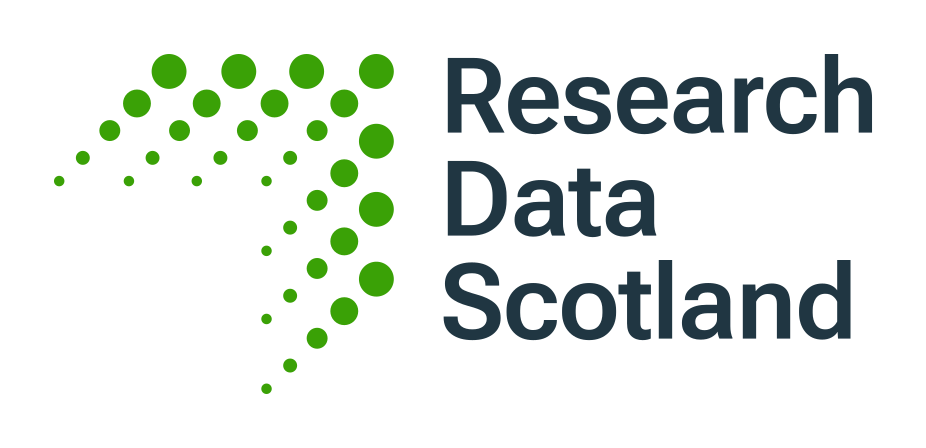

# TRE Community Conference 16-18 November 2026, Edinburgh

The **TRE Community Conference** will take place in Edinburgh, **Monday 16 - Wednesday 18 November 2026**.

It brings together funders, leaders, practitioners, researchers, technologists, policy makers, public members and innovators from across the Trusted Research Environments ecosystem.

Location: [DoubleTree by Hilton Edinburgh City Centre](https://www.google.com/maps/search/?api=1&query=DoubleTree+by+Hilton+Edinburgh+City+Centre%2C+34+Bread+Street+Edinburgh+GB)

## Registration

Registration opens on **1 September 2026**, and is completely free thanks to our sponsors.

??? info "Funding for public members"

    If you are a public member and an active member of a DARE UK-funded Community Group, your Community Group has funding available to support at least two public members to attend events such as the TRE Conference.
    _Please contact your Community Group in the first instance to request funding._
    _Funding will be considered on a case-by-case basis, so please speak to your Community Group Lead/Chair before making any arrangements._
    _You should not need to request this funding through the conference registration process._

## Sponsors

{ width="500" }

{ width="300" }
